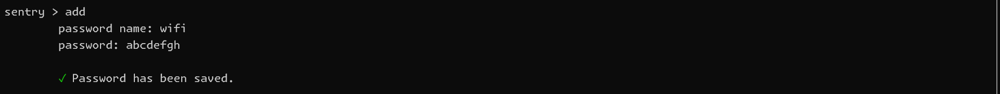
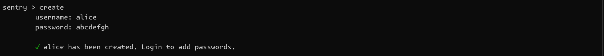
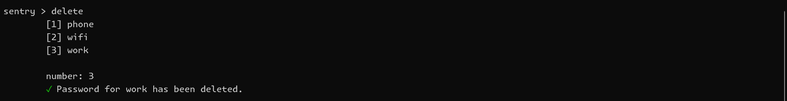
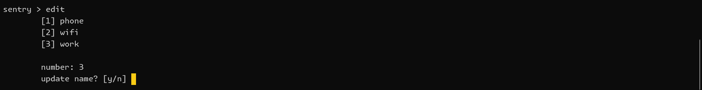
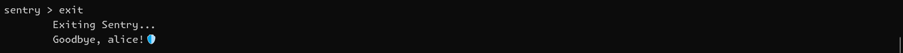
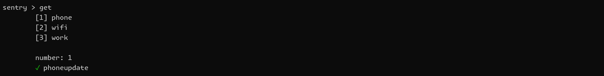
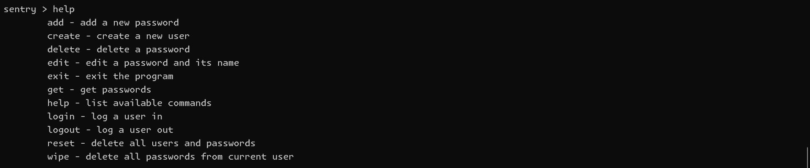
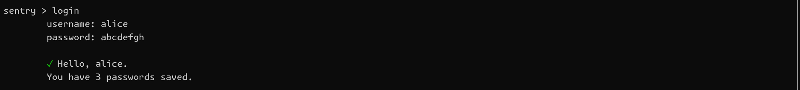
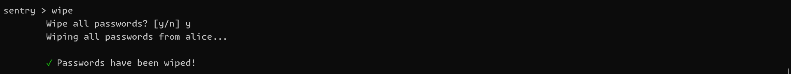

# Sentry 🛡️

## Table of Contents

- [About](#about)
- [Commands](#commands)
  - [Add](#add)
  - [Create](#create)
  - [Delete](#delete)
  - [Edit](#edit)
  - [Exit](#exit)
  - [Get](#get)
  - [Help](#help)
  - [Login](#login)
  - [Logout](#logout)
  - [Reset](#reset)
  - [Wipe](#wipe)
- [Installation](#installation)
  - [Database Setup](#database-setup)

## About

Sentry is a terminal-based password manager. I enjoy CLI tools and working in the terminal in general. I also use password managers regularly and recently completed the cryptography course on Boot.dev so I thought this would be a good project to work on.

Sentry is a fast REPL, uses a SQLite database, supports multiple users, encrypts passwords, and implements a cache. This was the first project I had done completely in Neovim which was an additional fun challenge.

Key concepts:

- Encryption
- Hashing
- Authentication
- Caching
- Writing SQL queries
- CRUD operations
- Input parsing/validation

## Commands

### add 🔒

Add a new password.



---

### `create` 🔓

Create a new user.



---

### `delete` 🔒

Delete a password.



---

### `edit` 🔒

Edit a password and its name.



---

### `exit` 🔓

Exit the program.



---

### `get` 🔓

Get passwords.



---

### `help` 🔓

List available commands.



---

### `login` 🔓

Log a user in.



---

### `logout` 🔒

Log a user out.


---

### `reset` 🔓

---

### `wipe` 🔒

Wipe all passwords from current user.



---

## Installation

Sentry only works on Linux/Mac and requires Golang. If on Windows, use WSL.

1. Install Go 1.22 or later

```bash
curl -sS https://webi.sh/golang | sh
```

2. Install Sentry

```bash
go install github.com/mshortcodes/sentry
```

### Database Setup
